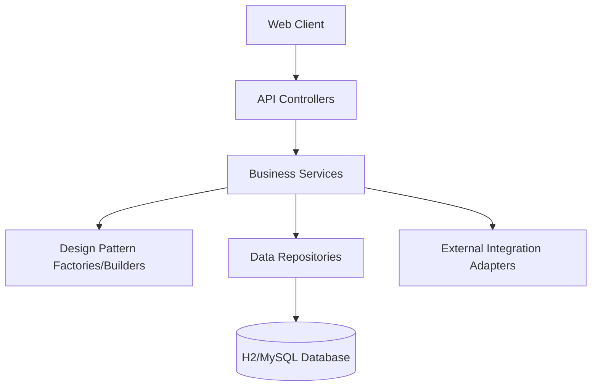

# 07 System Architecture

## Architectural Style: Layered MVC
The system follows the classic enterprise N-tier architecture to ensure separation of concerns and maintainability.

### 1. Presentation Layer (API)
- **Technology**: Spring Web / REST Controllers.
- **Responsibility**: Handle HTTP requests, validate input via DTOs, and return JSON responses.

### 2. Business Logic Layer (Service)
- **Technology**: Spring Service (@Service).
- **Responsibility**: Implement business rules, orchestrate design patterns (Factories, Builders), and manage transactions.

### 3. Data Access Layer (Repository)
- **Technology**: Spring Data JPA.
- **Responsibility**: Abstract database interactions using the Repository pattern.

### 4. Infrastructure Layer
- **Components**: Security (Spring Security), Messaging (Notifications), External API Adapters.

## High-Level Diagram (Textual Representation)

## Architectural Decisions
- **Loose Coupling**: Services communicate via interfaces.
- **Dependency Injection**: Managed by Spring IoC container.
- **Exception Handling**: Global exception handler for consistent error responses.
